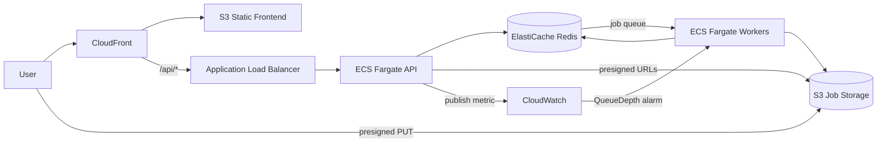

# GridMerge Design Doc

GridMerge is a web app for turning multiple PDFs into a single grid-based PDF.

## Background Motivation

Formula sheets, study guides, and organized note packs are useful, but making them by hand is slow and repetitive. GridMerge started as a small script to make that process easier for myself, and now into something to share.

The goal is simple: give people a fast way to turn lecture slides or notes into a compact, polished PDF that they can organize however they want, whether that is a grid layout or another structure that fits how they study.

## Requirements

### Functional Requirements

- [x] Merge input PDFs into a customizable grid layout.
- [x] Adjust settings: quality presets (Low/Standard/High/Ultra), titles, page size, margin, slides per row and column.
- [x] Organize the order of input PDFs with drag-and-drop before merging.
- [x] Name the output file before merging, with consistent sanitization (spaces to underscores, special characters stripped).
- [x] Download the final merged PDF.
- [x] View page count and file size for each uploaded PDF.
- [x] Cancel a running merge job.
- [x] Live grid layout preview that reflects current settings.

### Non-Functional Requirements

- [x] The system should be simple to use with a browser-based workflow.
- [x] Jobs should process reliably even when merging takes time (async queue with progress polling).
- [x] The architecture should support separate scaling of the API and worker.
- [x] Uploads should be validated for security: PDF-only file extension check, magic byte validation (`%PDF` header), filename sanitization, and server-side option clamping.
- [x] Rate limiting should prevent abuse (sliding window, 30 requests per minute).
- [x] Job data should expire automatically (1-hour TTL in Redis, 1-day lifecycle on S3 objects).
- [x] Failed jobs should retry automatically (up to 3 attempts, covering Fargate Spot reclamation).
- [ ] End-to-end merge time should stay under 30 seconds for typical workloads (around 50 MB total input).

## Low-Level Design Options

### Option 1: Single EC2 Instance, Synchronous API

This approach keeps the architecture minimal: CloudFront serves the website and one EC2-hosted API handles both request handling and PDF processing synchronously.

Pros:

- Lowest number of moving parts.
- Fast to deploy and debug.

Cons:

- Long merges block API requests.
- Responsiveness drops under heavier jobs.
- Scaling API and processing independently is not possible.

### Option 2: Single EC2 Instance with Redis and Worker Containers

This approach introduces async processing by running API, Redis, and worker containers on one EC2 machine, so the API can enqueue work instead of waiting for merges to finish.

Pros:

- Better user experience because the API responds quickly.
- Cleaner separation between request handling and background processing.
- Queue-based progress tracking becomes possible.

Cons:

- Single-host failure risk remains.
- Host operations and patching are still manual.
- Compute scaling is still constrained by one EC2 instance.

### Option 3: Current AWS Design (Selected)

This design uses managed AWS components for each layer: CloudFront and S3 for frontend delivery, ALB plus ECS Fargate for API and worker, Redis for queue state, and S3 for job files.

Pros:

- API and worker scale independently.
- Managed services reduce host-management overhead.
- Better reliability and clearer separation of concerns.
- Cost can be optimized with worker autoscaling and Fargate Spot.

Cons:

- More infrastructure components to configure.
- Higher initial setup complexity than single-EC2 options.
- Requires tighter IAM and observability discipline.

## Key Design Decisions

### Upload Strategy

In production the frontend uploads files directly to S3 using presigned URLs, bypassing the API for file transfer. This is a three-step flow:

1. `POST /api/jobs/prepare` — API creates the job and returns a presigned PUT URL per file.
2. Browser uploads all files to S3 in parallel.
3. `POST /api/jobs/{id}/start` — API enqueues the job for processing.

This keeps large file payloads off the API container and allows parallel uploads. For local development a multipart upload fallback (`POST /api/jobs`) sends files through the API directly.

### Processing Pipeline

Each worker job follows these steps:

1. List input keys from storage and download each PDF to a temp directory.
2. Validate every file's `%PDF` magic bytes (presigned uploads skip the API, so validation happens here).
3. Check for cancellation between PDFs.
4. Rasterize each PDF's pages in parallel using a `ProcessPoolExecutor` (one process per CPU core).
5. Compose rasterized pages into the grid layout and produce the output PDF.
6. Upload the result to storage and update the job record in Redis.

Rasterization is the most expensive step. Parallel processing across cores (2 vCPU worker) keeps this fast for large inputs.

### Download Strategy

When using S3 storage the download endpoint returns a presigned GET URL instead of streaming the file through the API. The frontend fetches the PDF directly from S3. The filename shown in the browser matches the sanitized name stored on the job record.

### Autoscaling

PDF merges are bursty. Some jobs are tiny, while others are expensive and CPU heavy. The scaling strategy uses two complementary mechanisms:

- **Scale up**: A CloudWatch alarm watches a custom `QueueDepth` metric (pending plus processing jobs in Redis). When the queue reaches 3 or more jobs, a step scaling policy adds workers, up to a maximum of 5.
- **Scale down**: A CPU target tracking policy at 60 percent gradually removes idle workers.

One worker is always kept warm (`min_capacity = 1`) to avoid cold-start delays. Workers use Fargate Spot (weighted 4:1 Spot to On-Demand) for roughly 70 percent cost savings, with ARQ configured to retry jobs up to 3 times to handle Spot reclamation.

### Cost Controls

- Fargate Spot for workers (~70 percent savings over On-Demand).
- S3 lifecycle rule deletes job files after 1 day.
- Redis job TTL of 1 hour.
- Minimum 1 worker always warm costs roughly $29 per month on Spot.
- API scales between 1 and 2 instances; workers scale between 1 and 5.

## Architecture Diagram

## Implementation Notes

- Both API and worker share a single Docker image from ECR, started with different entrypoints.
- The local development flow uses multipart upload and local file storage. The production flow uses presigned S3 URLs.
- ARQ (async Redis queue) handles job dispatch with `poll_delay=0.5s`, `max_jobs=2` per worker, and `job_timeout=600s`.
- Filename sanitization replaces spaces with underscores, strips special characters, and collapses repeated separators. The frontend displays the backend's sanitized filename on the completion card and uses it for the download.
- The API runs boto3 calls (worker wake-up and CloudWatch metric publish) as FastAPI `BackgroundTasks` so they do not block the response.
- A cron task runs every 10 minutes in the worker to clean up expired job data.
